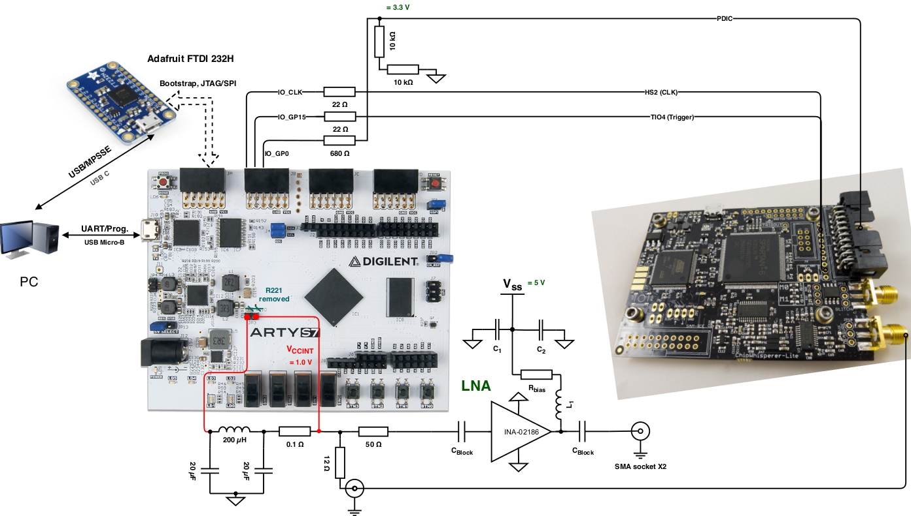

# OpenTitan


## About the project

[OpenTitan](https://opentitan.org) is an open source silicon Root of Trust
(RoT) project.  OpenTitan will make the silicon RoT design and implementation
more transparent, trustworthy, and secure for enterprises, platform providers,
and chip manufacturers.  OpenTitan is administered by [lowRISC
CIC](https://www.lowrisc.org) as a collaborative project to produce high
quality, open IP for instantiation as a full-featured product. See the
[OpenTitan site](https://opentitan.org/) and [OpenTitan
docs](https://docs.opentitan.org) for more information about the project.

## About this repository

This repository contains hardware, software and utilities written as part of the
OpenTitan project. It is structured as monolithic repository, or "monorepo",
where all components live in one repository. It exists to enable collaboration
across partners participating in the OpenTitan project.

## Documentation

The project contains comprehensive documentation of all IPs and tools. You can
either access it [online](https://docs.opentitan.org/) or build it
locally by following the steps below.

1. Ensure that you have the required Python modules installed (to be executed
in the repository root):

```command
$ sudo apt install curl python3 python3-pip
$ pip3 install --user -r python-requirements.txt
```

2. Execute the build script:

```command
$ ./util/build_docs.py --preview
```

This compiles the documentation into `./build/docs` and starts a local
server, which allows you to access the documentation at
[http://127.0.0.1:1313](http://127.0.0.1:1313).

## How to contribute

Have a look at [CONTRIBUTING](./CONTRIBUTING.md) for guidelines on how to
contribute code to this repository.

## Licensing

Unless otherwise noted, everything in this repository is covered by the Apache
License, Version 2.0 (see
[LICENSE](./LICENSE) for full text).


## Changes done for side-channel attacks on Arty S7
Several changes are done to perform side-channel attacks on the OpenTitan platform.

* 20 MHz system clock Pmod input defined (JB, P14). System clock is generated by Chipwhisperer.
* Input for reset via GPIO (JB, N15). Reset can be triggered via Chipwhisperer IO.
* PLL is removed for glitching.
* GPIO is used to trigger chipwhisperer (IO_GP15 in design is mapped to Pin P15 of Pmod JB)
* For flashing procedure, try to open external FTDI 232H first. Otherwise re-plug-in of Arty S7 is required. 

Two software examples are implemented:
* Simple glitch example
    * Break out from a while true loop and excecute code that should never be 
* Simple password check example
    * Break a password check routine via simple power analysis and timing analysis

### Setup


More details of wiring the Pins can be found in [pins_artys7.xdc](hw/top_earlgrey/data/pins_artys7.xdc) file and on [Arty S7 reference page](https://reference.digilentinc.com/reference/programmable-logic/arty-s7/reference-manual) 


